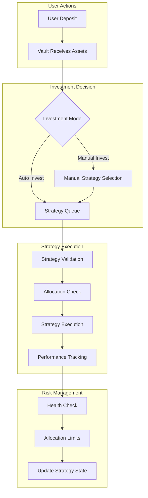
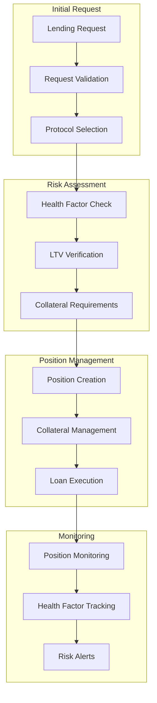

# ctVault (Carry Trade Vault)

## Overview

ctVault is a sophisticated DeFi vault system that enables carry trade operations in the market. Carry trading is a
strategy where an investor borrows funds at a lower interest rate and invests them in an asset that provides a higher
return, profiting from the interest rate differential (the "carry").

In the context of DeFi, carry trading typically involves:

1. Borrowing assets at a lower interest rate from lending protocols
2. Investing the borrowed assets in higher-yielding strategies
3. Managing the interest rate spread while maintaining proper risk management

The vault is designed to be a flexible and secure platform for executing carry trade strategies across different
protocols and strategies, with built-in risk management and position monitoring.

## Architecture

### Core Components

#### 1. Storage System

The vault uses an ERC7201 storage system (`CtVaultStorage`) that manages:

**Key Metrics:**

- `totalInvested`: Total assets deployed in investment strategies
- `totalBorrowed`: Total assets borrowed through lending protocols
- `totalCollateral`: Total assets used as collateral
- `harvestThreshold`: Minimum earnings required to trigger a harvest
- `performanceFee`: Fee charged on earnings (up to 50%)
- `syncCooldown`: Time between sync operations
- `slippageTolerance`: Maximum allowed slippage for swaps (1% = 100)

**Configuration:**

- `autoInvest`: Whether to automatically invest deposited assets
- `feeRecipient`: Address receiving system fees
- `investmentAsset`: Primary investment token
- `swapRouter`: Address for token swaps

#### 2. Core Modules

##### Investment Module

- Maximum 20 investment strategies
- Dynamic strategy allocation
- Investment queue management
- Strategy state tracking

**Strategy Management:**

- Each strategy has:
  - `allocated`: Current asset allocation
  - `maxAllocation`: Maximum allowed allocation
  - `enabled`: Whether the strategy is active

**Investment Actions:**

- `INVEST`: Deploy assets to a strategy
- `DIVEST`: Remove assets from a strategy
- Queue-based execution system
- Automatic allocation limits enforcement

##### Lending Module

- Maximum 5 lending protocols
- LTV (Loan-to-Value) management
- Health factor monitoring
- Collateral management

**Lending Configuration:**

- `maxAllocation`: Maximum assets per protocol
- `targetLTV`: Optimal loan-to-value ratio
- `minLTV`: Minimum allowed LTV
- `maxLTV`: Maximum allowed LTV

**Lending Actions:**

- `REPAY`: Repay borrowed assets
- `ADD_COLLATERAL`: Add collateral
- `REMOVE_COLLATERAL`: Remove collateral
- `BORROW`: Borrow assets

#### 3. Supporting Systems

##### Oracle System

- Chainlink-based price feeds
- Supports multiple assets
- Price scaling to 18 decimals
- Safety checks for:
  - Stale prices
  - Invalid prices
  - Incomplete rounds

##### Swap Router

- Uniswap integration
- Exact token-to-token swaps
- Slippage protection
- Automatic token approvals

## Operational Flow

### 1. Asset Management



### 2. Lending Operations



### 3. Risk Management

- Strategy allocation limits
- LTV thresholds
- Slippage protection
- Sync cooldown periods
- Performance fee caps

## Security Features

### 1. Access Control

- Role-based authorization
- Owner privileges
- Operator permissions
- Strategy-specific access

### 2. Safety Mechanisms

- Pausable functionality
- Emergency stops
- Health factor monitoring
- Oracle validation

### 3. Asset Protection

- Slippage controls
- Allocation limits
- Collateral requirements
- Fee management

## Technical Implementation

### 1. Error Handling

**Key Error Categories:**

- Common errors (zero amounts, unauthorized access)
- Investment errors (allocation limits, strategy issues)
- Lending errors (LTV limits, health factors)
- Oracle errors (price feed issues)

### 2. Events System

- Investment queue updates
- Strategy state changes
- Fee updates
- Router changes
- Performance tracking

### 3. Storage Optimization

- Packed storage slots
- Efficient data structures
- Gas-optimized operations

## Public/External Methods

### ctVault Contract

| Method Name | Visibility | Modifiers               |
| ----------- | ---------- | ----------------------- |
| initialize  | public     | initializer             |
| mint        | public     | whenNotPaused, override |
| deposit     | public     | whenNotPaused, override |
| redeem      | public     | whenNotPaused, override |
| withdraw    | public     | whenNotPaused, override |
| totalAssets | public     | view, override          |

### BaseChainlinkOracle Contract

| Method Name | Visibility | Modifiers     |
| ----------- | ---------- | ------------- |
| price       | public     | view, virtual |
| getValue    | external   | view          |
| getAmount   | external   | view          |

### BaseLendingAdapter Contract

| Method Name      | Visibility | Modifiers     |
| ---------------- | ---------- | ------------- |
| addCollateral    | external   | onlyVault     |
| removeCollateral | external   | onlyVault     |
| borrow           | external   | onlyVault     |
| repay            | external   | onlyVault     |
| repayAll         | public     | onlyVault     |
| logStats         | external   |               |
| getCollateral    | public     | view, virtual |
| getBorrowLimit   | public     | view, virtual |
| getBorrowed      | public     | view, virtual |
| getSupplyAPY     | public     | view, virtual |
| getBorrowAPY     | public     | view, virtual |
| getHealthFactor  | public     | view, virtual |

### ConfigModule Contract

| Method Name          | Visibility | Modifiers    |
| -------------------- | ---------- | ------------ |
| setSwapRouter        | external   | requiresAuth |
| setFeeRecipient      | external   | requiresAuth |
| setPerformanceFee    | external   | requiresAuth |
| setSyncCooldown      | external   | requiresAuth |
| setAutoInvest        | external   | requiresAuth |
| setHarvestThreshold  | external   | requiresAuth |
| setSlippageTolerance | external   | requiresAuth |

### InvestmentModule Contract

| Method Name       | Visibility | Modifiers    |
| ----------------- | ---------- | ------------ |
| setInvestQueue    | external   | requiresAuth |
| addStrategy       | external   | requiresAuth |
| getTotalInvested  | public     | view         |
| investQueueAt     | public     | view         |
| investQueueLength | public     | view         |
| investQueue       | public     | view         |
| divestQueueAt     | public     | view         |
| divestQueueLength | public     | view         |
| divestQueue       | public     | view         |

### LendingModule Contract

| Method Name           | Visibility | Modifiers    |
| --------------------- | ---------- | ------------ |
| setLendingProtocol    | external   | requiresAuth |
| lendingAdaptersAt     | public     | view         |
| lendingAdaptersLength | public     | view         |
| lendingAdapters       | public     | view         |
| getBorrowAmount       | public     | view         |
| convertToCollateral   | public     | view         |
| getVaultLTV           | public     | view         |
| getState              | public     | view         |
| getTotalCollateral    | public     | view         |
| getTotalBorrowed      | public     | view         |

### BaseStrategy Contract

| Method Name         | Visibility | Modifiers     |
| ------------------- | ---------- | ------------- |
| invest              | public     | onlyVault     |
| divest              | public     | onlyVault     |
| divestAll           | public     | onlyVault     |
| claimRewards        | public     | onlyHarvester |
| setRewardsHarvester | public     | onlyOwner     |
| idle                | public     | view, virtual |
| asset               | public     | view, virtual |
| totalAssets         | public     | view, virtual |
| totalInvested       | public     | view, virtual |

### FixedPriceOracle Contract

| Method Name | Visibility | Modifiers      |
| ----------- | ---------- | -------------- |
| price       | public     | view, override |

### ctVaultAssetOracle Contract

| Method Name | Visibility | Modifiers      |
| ----------- | ---------- | -------------- |
| price       | public     | view, override |

## Integration Points

### 1. External Protocols

- Morpho lending protocol
- Uniswap for swaps
- Chainlink for prices

### 2. Strategy Interface

**Required Methods:**

- `invest()`
- `divest()`
- `getValue()`
- `getAPY()`

## Development Guidelines

### 1. Adding New Strategies

1. Implement IStrategy interface
2. Extend BaseStrategy
3. Configure allocation limits
4. Add to investment queue

### 2. Adding Lending Protocols

1. Implement ILendingAdapter
2. Configure LTV parameters
3. Set up collateral management
4. Add to lending adapters list

### 3. Testing Requirements

- Unit tests for all modules
- Integration tests for protocols
- Oracle price tests
- Security tests

## Directory Structure

```
ctVault/
├── interfaces/         # Interface definitions
├── libraries/         # Shared libraries and storage
├── modules/          # Core vault modules
│   ├── ConfigModule.sol
│   ├── InvestmentModule.sol
│   └── LendingModule.sol
├── oracles/          # Price oracle implementations
├── strategies/       # Investment strategy implementations
├── lendingAdapters/  # Lending protocol adapters
├── swap/            # Swap router implementations
└── Types.sol        # Shared type definitions
```

## Dependencies

- OpenZeppelin Contracts
- Solmate Auth
- Chainlink Price Feeds
- Uniswap V3
- Morpho Protocol

## License

MIT
